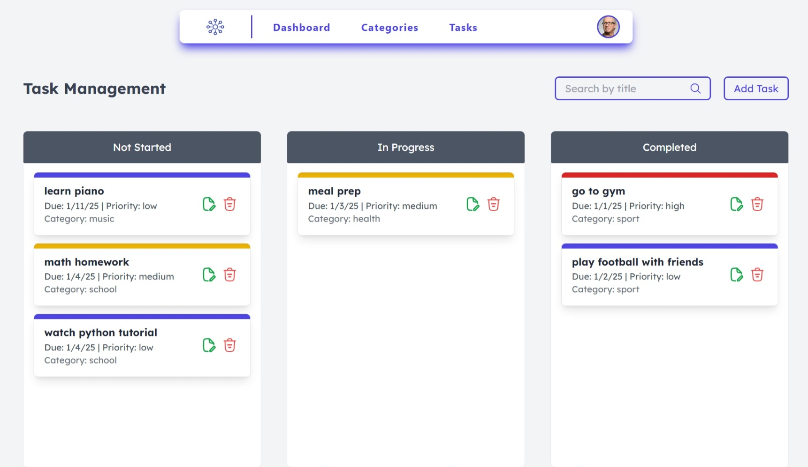
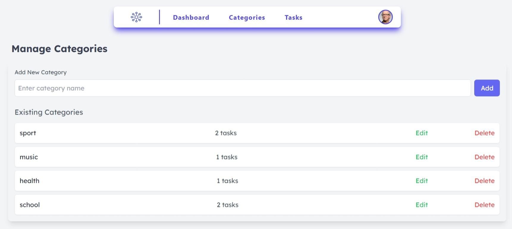
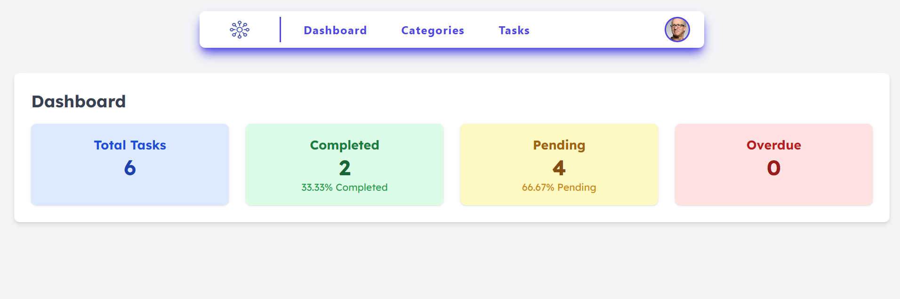

# Goalie

This is a Task Management Application built with Angular. It allows users to manage tasks and categories, providing functionalities to add, edit, delete, and search tasks and categories.

## Features

- Add, edit, delete, and search tasks
- Add, edit, delete, and search categories
- Filter tasks by status (not started, in progress, completed)
- Display task statistics on the dashboard

## Technologies Used

- Angular
- TypeScript
- HTML
- CSS
- Tailwind CSS

## Getting Started

### Prerequisites

- Node.js and npm installed
- Angular CLI installed

### Installation

1. Clone the repository:
   ```bash
   git clone https://github.com/MesVortex/Goalie.git
   ```
2. Navigate to the project directory:
   ```bash
   cd Goalie
   ```
3. Install the dependencies:
   ```bash
   npm install
   ```

### Running the Application

1. Start the development server:
   ```bash
   ng serve
   ```
2. Open your browser and navigate to `http://localhost:4200`.

### Building the Application

To build the application for production, run:
```bash
ng build
```

## Project Structure

- `src/app`: Contains the main application code
  - `components`: Contains the Angular components
    - `category`: Category management component
    - `task`: Task management component
    - `dashboard`: Dashboard component
    - `header`: Header component
  - `models`: Contains the data models
  - `services`: Contains the services for handling business logic and data
- `src/assets`: Contains static assets
- `src/environments`: Contains environment configuration files

## Usage

### Managing Tasks

- Navigate to the "Tasks" page to view, add, edit, and delete tasks.
- Use the search bar to filter tasks by title or description.



### Managing Categories

- Navigate to the "Categories" page to view, add, edit, and delete categories.



### Dashboard

- Navigate to the "Dashboard" page to view task statistics, including total tasks, completed tasks, pending tasks, and overdue tasks.



## Contributing

Contributions are welcome! Please follow these steps to contribute:

1. Fork the repository.
2. Create a new branch for your feature or bugfix.
3. Make your changes and commit them with descriptive messages.
4. Push your changes to your forked repository.
5. Create a pull request to the main repository.

## Planning

Jira is used for planning and tracking the progress of this project. You can view Jira board [here](https://meskinemsoatafa.atlassian.net/jira/software/projects/GOAL/boards/18/backlog).

## Figma Design

The design prototypes and mockups are created using Figma. You can view the Figma design [here](https://www.figma.com/design/zU7VSnbJ4h169IhCzPstYS/Goalie?node-id=0-1&t=8763jYqfe4AV5h4A-1).


## Contact

For any questions or feedback, please contact The author of this project:

- **Meskine Mostafa**
  - Email: meskinemostafa4@gmail.com
  - GitHub: [Meskine Mostafa](https://github.com/MesVortex).
